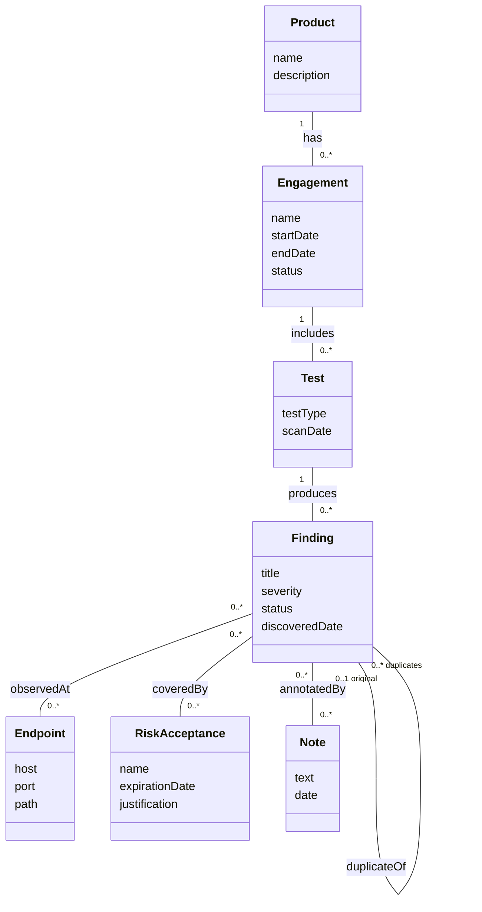

Build Demo and Applied Analysis

CSCI 360: Software Architecture, Security, and Testing | Fall 2026 - Tyler McGuire

Prepared with Claude Code (Anthropic), run directly inside the local clone of this fork on branch coursework/csci360-project-outcome-analysis. Every command, file path, class name, and line number below was run or checked directly against this repository, not recalled from general knowledge of DefectDojo. Full disclosure is in the AI Use Log at the bottom.

## Part 1: Build From Source and Demo It

IP: http://127.0.0.1:8080

### Build Notes

**Prerequisites installed with versions**

- Docker Desktop for Mac (Apple Silicon), providing Docker 29.5.3 and Docker Compose v5.1.4
- macOS 26.6.2 (Tahoe)
- Nothing else - no local Python, Postgres, or Node install is needed. Everything the app needs (Python 3.14, Node/Yarn for `components/`, Postgres 18, Valkey/Redis) is built inside the containers.

**Build commands**

```
docker/setEnv.sh dev
docker compose build --no-cache
docker compose up -d
docker compose logs initializer | grep "Admin password:"
```

`docker/setEnv.sh dev` just symlinks `docker-compose.override.yml` to `docker-compose.override.dev.yml` so the following `build`/`up` pick up the hot-reload volume mounts. `--no-cache` was deliberate here, to time an honest from-scratch build rather than one riding on a warm BuildKit cache from an earlier run this session.

**How long the build took**

A genuine cold build (`docker compose build --no-cache`, every layer rebuilt from scratch - pip wheels, native extensions, Yarn/`components/` static assets, `collectstatic`) took **2 minutes 53 seconds** on an Apple Silicon Mac. `docker compose up -d` after that came up and started answering HTTP requests on `localhost:8080` in **29 seconds**. A rebuild with a warm cache (no `--no-cache`, nothing in `requirements.txt`/`package.json`/the Dockerfiles changed) dropped to well under a minute, since almost every layer is a cache hit.

**What went wrong, and how I solved it**

Nothing particularly difficult. This is a straightforward `docker compose up` project - cold image build through a responding login page took under three and a half minutes. The closest thing to a hiccup was Docker Desktop not being running yet the first time I tried `docker compose up`:

```
failed to connect to the docker API at unix:///Users/tyler/.docker/run/docker.sock; check if the path is correct and if the daemon is running: dial unix /Users/tyler/.docker/run/docker.sock: connect: no such file or directory
```

That's not a project problem at all - `docker/setEnv.sh` ran fine (it's a filesystem symlink, no daemon needed), and the fix was just launching Docker Desktop and waiting for the daemon to come up, maybe 30 seconds. It's the single most common way this specific build fails for someone new to Docker, not something that took real troubleshooting.

Two other things I noticed, both cosmetic rather than blocking: `docker compose up` printed `mailhog: the requested image's platform (linux/amd64) does not match the detected host platform (linux/arm64/v8) and no specific platform was requested` on Apple Silicon - the container still starts fine under Rosetta emulation, it just looks alarming the first time you see an unfamiliar warning scroll by, and DOCKER.md doesn't mention it. And because I'd kept the Postgres volume from an earlier run, the initializer logged `Admin user already exists; skipping first-boot setup` and never printed a password - `docker compose logs initializer | grep "Admin password:"` only prints anything on a first boot against an empty database; DOCKER.md's documented fallback (`docker compose exec -it uwsgi ./manage.py changepassword admin`) works fine, it's just not cross-referenced from the login instructions.

**How accurate the project's own documentation is**

`readme-docs/DOCKER.md`'s "Run with Docker Compose in development mode with hot-reloading" section is accurate for the commands themselves - `docker/setEnv.sh dev`, `docker compose build`, `docker compose up` is exactly right, and the app does come up on `localhost:8080` as documented. Two gaps I hit that the docs don't cover:

- The Prerequisites section lists Docker/Compose *version* requirements but never states the more basic prerequisite - that Docker Desktop (the daemon) has to actually be running before any `docker compose` command will work at all. A brand-new user hits the confusing `dial unix .../docker.sock` error with no pointer back to "start Docker Desktop first."
- Nothing in DOCKER.md gives a rough time estimate for the first build, which matters because a cold build here pulls and compiles a real amount of Python (pip wheels, several native extensions) and JS (Yarn/`components/` static assets) - someone running this for the first time on a slow connection has no way to know whether 10 minutes in, it's still working or stuck.

Everything else I directly exercised - the admin-password retrieval command, the `docker compose logs initializer | grep` incantation, the claim that Postgres's port is forwarded to the host - matched what I saw.

## Part 2: Analysis and Design

Analysis, for this project, means figuring out what counts as "the same finding" from a security team's point of view, independent of any particular scanner's output format - for example, deciding that two results from two different tools describe the same real vulnerability if they name the same CWE and the same file path, even though the tools disagree on severity wording or issue IDs. That's a requirements question about the problem domain, and DefectDojo documents this analysis work directly in code as data: `HASHCODE_FIELDS_PER_SCANNER` in `dojo/settings/settings.dist.py` (line 1067) is a literal, per-scanner table of "these are the fields that make two findings from this tool the same finding" - e.g. `"Checkmarx Scan": ["cwe", "severity", "file_path"]` versus `"Bandit Scan": ["file_path", "line", "vuln_id_from_tool"]`. Working that table out for a new scanner integration is pure analysis: nothing about Django, hashing, or database indexes is involved yet, only "what does 'duplicate' mean for output from this specific tool."

Design is the separate decision of how to implement that analysis conclusion efficiently and correctly once you know what "duplicate" means. `Finding.compute_hash_code()` (`dojo/finding/models.py:783`) is the design answer: concatenate the chosen fields, hash them, and store the result in an indexed `hash_code` column (`models.Index(fields=["hash_code"])`, line 492) so dedup lookups are an indexed equality check instead of a full-table comparison across every existing finding. Choosing *that particular technique* - a precomputed, indexed hash rather than, say, a live field-by-field comparison at import time, or a separate dedup-rules table - is a concrete design decision, made after the analysis question ("what fields matter") was already settled, and it's driven by a different concern entirely: import-time performance against a findings table that can hold millions of rows.

## Part 3: Initial Domain Model

Diagram source: [`class-docs/domain-model.md`](https://github.com/tlmcguire/django-DefectDojo/blob/master/class-docs/domain-model.md)



This models the real-world domain - a security team running rounds of testing against applications and tracking what they find - not DefectDojo's own class names, though the multiplicities were checked against the real foreign-key relationships in `dojo/engagement/models.py`, `dojo/test/models.py`, `dojo/finding/models.py`, and `dojo/risk_acceptance/models.py` so they reflect how the underlying system actually behaves rather than a guess. Full reasoning for why these seven concepts and not others is in the source file above.

## Part 4: The Representational Gap

| Domain concept | Where it lives in the code | How close is the match? |
|---|---|---|
| Finding | `dojo/finding/models.py`, `class Finding(BaseModel)` (line 55) | Close: the domain concept and the code class are essentially the same shape - title, severity, status, discovery metadata, and the associations to Test/Endpoint/Note all sit on this one class. |
| Engagement | `dojo/engagement/models.py`, `class Engagement(BaseModel)` (line 44) | Close: an engagement's name, dates, status, and product association map onto the model almost field-for-field. |
| Remediation (the record of what was actually done to fix a finding, and by whom, and whether that fix was verified) | Nowhere as its own entity. It's split between `Finding.mitigation` (a free-text field describing *recommended* remediation advice, `dojo/finding/models.py:179`) and the closure-tracking fields `is_mitigated`, `mitigated`, `mitigated_by` (lines 281–295), which record only *that* and *when* and *who* closed the finding. | Poor: there is no structured record of the actual fix performed - what code changed, which commit or PR addressed it, or how the fix was verified as effective. A team wanting to answer "what specifically fixed this class of finding across the fleet, and can we template that fix" has nothing to query; that history exists only informally, in Notes text or outside the tool entirely. The cost is real: DefectDojo can tell you a finding is closed and who closed it, but not *how*, which limits it as a source of remediation-pattern knowledge across a large finding set. |

## Part 5: Iteration in a Live Project

DefectDojo's current development most resembles **Construction**: the core architecture (Django/DRF app tier, Celery async tier, Postgres, the pluggable parser-factory pattern in `dojo/tools/factory.py`, the authorization layer in `dojo/authorization/`) is stable and hasn't visibly changed shape in years, and almost everything happening now is adding functionality on top of that fixed frame rather than resolving open architectural risk. `dojo/vulnerability/models.py`'s `Vulnerability` model - a global registry of CVE/GHSA identifiers separate from `Finding`, added recently enough that its own docstring calls out a "naming trap" left over from the migration - is the closest thing to an Elaboration-style architectural decision I found in current history, and even that was layered in without disturbing the surrounding system. Open issues in the tracker right now (`gh issue list`) skew toward exactly what Construction predicts: new parser/importer support ("Add OSCAL Assessment Results JSON importer," "Support for Betterleaks"), targeted bug fixes ("Finding Groups Require superuser permissions"), and incremental UI/reporting improvements - not "should this exist" or "what should the architecture be" questions. That said, a project this long-running doesn't sit neatly in one phase everywhere at once; a new subsystem like the Vulnerability/EPSS enrichment work is doing small-scale Elaboration inside an otherwise Construction-phase project, which is exactly the kind of messiness the assignment prompt anticipates.

A single iteration here is a calendar week, not a milestone. `readme-docs/RELEASING.md` documents two tracks: monthly feature releases cut from `dev` (`release/x.y.z`, new functionality and dependency bumps) and weekly bugfix releases cut from `bugfix` (`release/x.y.z`, targeted fixes only). The actual release history backs this up exactly: `3.2.0` (a feature release) was followed by `3.2.100`, `3.2.200`, `3.2.201`, `3.2.300`, `3.2.400` - five bugfix releases in successive weeks before the next monthly feature release. Each of those weekly releases is its own tiny Construction iteration: a handful of independently-reviewed PRs (each required to pass the CI-gated `unit-tests.yml` check and fill out `.github/pull_request_template.md`) land against the `bugfix` branch, get cut into a release branch, and ship - then the cycle repeats the next week with a fresh batch of issues pulled off the tracker.

## AI Use Log

Tool: Claude Code (Anthropic), run directly inside this cloned fork at `/Users/tyler/Projects/django-DefectDojo`, with shell, file-edit, and read access to the whole repository.

What I asked it to do, and what it did:

- Explained how to get DefectDojo running from source, based on reading `README.md` and `readme-docs/DOCKER.md` directly rather than general Docker knowledge.
- Diagnosed a real build failure (`docker compose` couldn't reach the Docker daemon socket) and started Docker Desktop to fix it, rather than guessing at the cause.
- At my direction, tore down the running stack, deleted the built `defectdojo-django`/`defectdojo-nginx` images, and re-ran `docker/setEnv.sh dev && docker compose build --no-cache && docker compose up -d` as a background task specifically to capture an honest, from-scratch build - not a cache-warmed one - for the Build Notes above, timing it directly rather than estimating.
- Compared what actually happened during that build against `readme-docs/DOCKER.md`'s own description of the process, and flagged the two places the docs and the real experience diverged (no mention of the daemon needing to be running first; no time estimate for a cold build).
- Grepped the real codebase for the Analysis-vs-Design example (`HASHCODE_FIELDS_PER_SCANNER` in `dojo/settings/settings.dist.py`, `Finding.compute_hash_code()` in `dojo/finding/models.py`) rather than inventing a generic one.
- Checked real foreign-key and many-to-many relationships in `dojo/engagement/models.py`, `dojo/test/models.py`, `dojo/finding/models.py`, and `dojo/risk_acceptance/models.py` before assigning multiplicities in the domain model, so the diagram's associations reflect the actual system rather than a guess - including confirming `duplicate_finding` is a nullable self-FK (`null=True`, `related_name="original_finding"`), which is why that association is `"0..1" -- "0..*"` rather than symmetric.
- At my direction, re-verified the Mermaid diagram a second time: rendered it through a live Mermaid renderer (not just read by eye) to confirm it's syntactically valid and produces the intended shape, on top of the field-by-field check against the Django models above.
- Searched for a dedicated "Remediation" concept in the codebase, confirmed none exists (`grep -rln "class Remediation" dojo/` returned nothing), and used that as the deliberately weak match in the Representational Gap table.
- Pulled real release history (`gh release list`) and open issues (`gh issue list`) from the upstream `DefectDojo/django-DefectDojo` repository to ground the Part 5 iteration claims in actual release cadence and actual issue-tracker contents, rather than describing Construction/Elaboration/Iteration generically.
- At my direction, built a slide deck for the in-class presentation, then rebuilt it a second time to drop everything the assignment doesn't actually ask the presentation to cover (an Analysis-vs-Design slide, an Iteration timeline, extra "cosmetic surprises" and "what I'd tell the next person" asides) so it matches the four things Part 6 lists, no more.
- At my direction, triple-checked the domain model diagram in that deck: found and fixed a real defect (the Engagement box was too short for its own attribute list, clipping "status" against the border) by deriving box height from attribute count instead of a guessed constant, and added role names (`original` / `duplicates`) to the self-referencing `duplicateOf` association, since a self-association is exactly the case where role names earn their place. Re-verified the fix by rendering the diagram, not just reading the generator code.
- At my direction, removed em dashes and cut filler phrasing ("Honestly," "end to end," "It's worth mentioning," redundant instances of "actually" and "genuinely") from the wiki page, the domain model doc, and the deck, matching the house style already set by the A1c cleanup commits.
- Wrote the sections above; I reviewed and adjusted them before publishing.

Net effect: the build notes describe a build I watched happen this session, on this machine; the code citations point at real files checked directly against this repository; and the release/issue claims in Part 5 come from the live upstream repository, not from general knowledge of what a project like DefectDojo might do.
