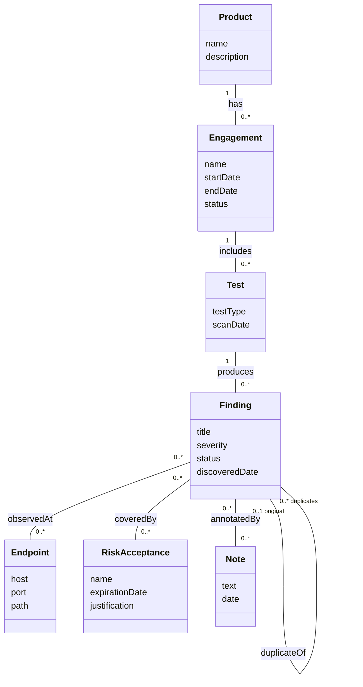

# Domain Model - Application Security Vulnerability Management

CSCI 360 (Software Architecture, Security, and Testing) | Fall 2026 - Tyler McGuire

Source for the domain model on the "Build Demo and Applied Analysis" wiki page.
This models the real-world problem DefectDojo solves - tracking security testing and the
vulnerabilities it finds - not the Django classes that implement it. See the "Representational
Gap" section of the wiki page for how these concepts map (or fail to map) onto actual code.

## Why these seven and not others

- **Product, Engagement, Test** form the containment chain a security team thinks in:
  "we're testing this application, during this round of testing, using this particular scan."
- **Finding** is the central concept - the thing the whole system exists to track.
- **Endpoint** is kept separate from Finding because the same vulnerability is frequently
  observed at many URLs/hosts, and the same endpoint frequently carries many unrelated
  findings - a genuine many-to-many, not an attribute of either side.
- **RiskAcceptance** is a distinct concept, not a status flag on Finding, because it carries
  its own lifecycle (a justification, an owner, an expiration date) independent of any single
  finding it covers.
- **Note** is kept as its own concept because a note has its own authorship and timestamp
  independent of the finding it's attached to, and it's just as important on other domain
  concepts. I picked five as a floor, not a ceiling; seven is what came out of only including
  things I could describe without pointing at a table name.

## Deliberately excluded

- **Methods** - behavior belongs to a class diagram, not a domain model.
- **Types and visibility markers** - same reason.
- **Vulnerability-as-a-separate-concept from Finding** - in the domain, "the vulnerability"
  and "the finding of that vulnerability in this environment" are worth distinguishing (one CVE,
  many findings across many products). I left this distinction out of the diagram to keep the
  model small enough to reason about, but it's exactly the seam explored in the Representational
  Gap section on the wiki page, where the code *does* draw this line.
