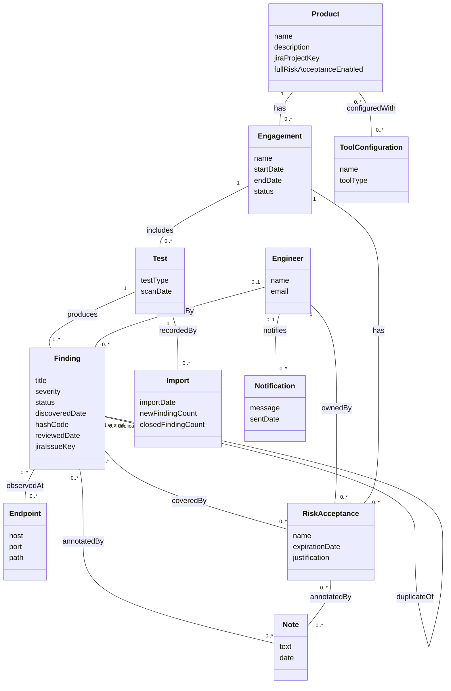

# Domain Model - Application Security Vulnerability Management

CSCI 360 (Software Architecture, Security, and Testing) | Fall 2026 - Tyler McGuire

Source for the domain model referenced from the "Build Demo and Applied Analysis" wiki page
(original seven-class version) and, as of the noun-phrase-driven revision below, the "SSDs and
Operation Contracts" wiki page. This models the real-world problem DefectDojo solves - tracking
security testing and the vulnerabilities it finds - not the Django classes that implement it.
See the "Representational Gap" section of the Build Demo wiki page for how these concepts map
(or fail to map) onto actual code.

## What changed from the previous model, and why

The previous version (seven classes: Product, Engagement, Test, Finding, Endpoint,
RiskAcceptance, Note) came from reading the codebase in general. This version came from a
noun-phrase pass over the three fully-dressed use cases in
[`requirements-and-use-cases.md`](requirements-and-use-cases.md) - full table on the "SSDs and
Operation Contracts" wiki page - and it surfaced a real gap: every one of those use cases is
driven by an actor who was completely absent from the diagram. **Engineer** was added because
the model had no way to say who reviewed a Finding, who owns a RiskAcceptance, or who a
Notification goes to - all three are real associations, not attributes, since a reviewer or
owner is a person with identity, not a piece of text. Three more classes came from durable,
created-and-later-displayed things that a single "what does the system track" pass over the
models missed: **ToolConfiguration** (a saved, reusable connection to a scanner, checked in the
Import Scan Results precondition), **Import** (the created record of one import run, checked
against the real `Test_Import` model), and **Notification** (checked against the real `Alerts`
model, not the confusingly-named `Notifications` model, which is actually per-user notification
*preferences*, not a sent notification - itself a small representational gap). Five identifiers
became attributes rather than classes under Larman's rule - `Finding.hashCode`,
`Finding.reviewedDate`, `Finding.jiraIssueKey`, `Product.jiraProjectKey`,
`Product.fullRiskAcceptanceEnabled` - because the use case text calls each one a value ("a hash
code," "a JIRA issue key") rather than a thing with its own behavior. Finally, two associations
that the use case text already implied were simply missing from the old diagram: RiskAcceptance
is attached to the **Engagement**, not only to the Finding(s) it covers, and its justification is
saved as a **Note** on the acceptance itself, not on the Finding - the old model only ever
connected Note to Finding. One simplification: `Engagement.risk_acceptance`
(`dojo/engagement/models.py:73`) is actually a many-to-many in the implementation (engagement
copies can share an acceptance), but a formal risk acceptance conceptually originates in one
engagement, so the diagram draws the ordinary case, `Engagement "1" -- "0..*" RiskAcceptance`,
rather than the copy-support edge case.

## Why these eleven and not others

- **Product, Engagement, Test** form the containment chain a security team thinks in:
  "we're testing this application, during this round of testing, using this particular scan."
- **Finding** is the central concept - the thing the whole system exists to track.
- **Endpoint** is kept separate from Finding because the same vulnerability is frequently
  observed at many URLs/hosts, and the same endpoint frequently carries many unrelated
  findings - a genuine many-to-many, not an attribute of either side.
- **RiskAcceptance** is a distinct concept, not a status flag on Finding, because it carries
  its own lifecycle (a justification, an owner, an expiration date) independent of any single
  finding it covers.
- **Note** is kept as its own concept because a note has its own authorship and timestamp
  independent of whatever it's attached to, and (per the change above) it now attaches to more
  than one kind of thing.
- **Engineer** is the primary actor in all three use cases; without it, "who reviewed this" or
  "who owns this acceptance" has nowhere to attach except a free-text field.
- **ToolConfiguration** persists independently of any one import (the same configuration is
  reused import after import), which is exactly Larman's test for a class rather than an
  attribute.
- **Import** is a created record with its own identity and its own counts, distinct from any
  single Finding it affects - checked against `Test_Import` in `dojo/test/models.py:234`.
- **Notification** is a real thing sent to a specific person and reviewed later, not just a
  string - checked against `Alerts` in `dojo/notifications/models.py:123`.

## Deliberately excluded

- **Methods** - behavior belongs to a class diagram, not a domain model.
- **Types and visibility markers** - same reason.
- **Vulnerability-as-a-separate-concept from Finding** - in the domain, "the vulnerability"
  and "the finding of that vulnerability in this environment" are worth distinguishing (one CVE,
  many findings across many products). I left this distinction out of the diagram to keep the
  model small enough to reason about, but it's exactly the seam explored in the Representational
  Gap section on the wiki page, where the code *does* draw this line.
- **JiraIssue / JiraProject as their own classes** - the use case text only ever refers to "a
  JIRA issue key" and "a JIRA project," both named as values, not as things with their own
  behavior, so they became `Finding.jiraIssueKey` and `Product.jiraProjectKey` instead of two
  more classes.
- **Import performed by an Engineer** - conceptually someone performs every import, but
  `Test_Import` (`dojo/test/models.py:234`) has no field recording who, so this association
  isn't added; adding it would model an audit trail the real system doesn't keep.
- **A false-positive-history concept, separate from Finding.status** - checked against the
  Triage a Finding use case's step 5, this is bookkeeping the system uses internally for future
  deduplication, not a new fact a security team would describe about the domain.
