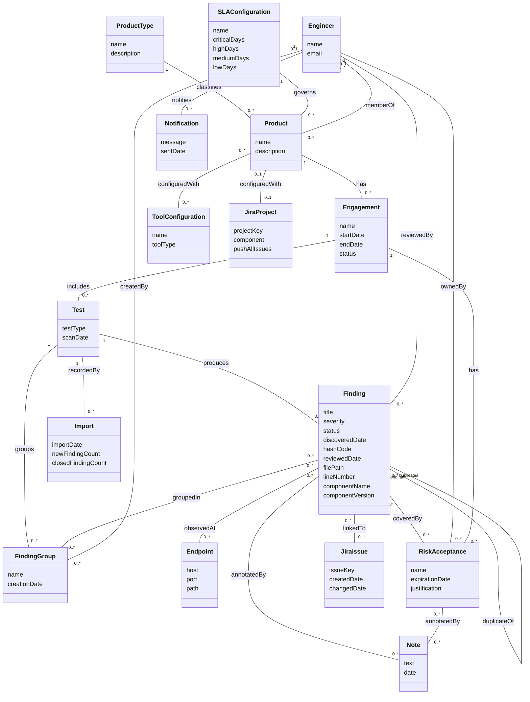

# Domain Model - Application Security Vulnerability Management

CSCI 360 (Software Architecture, Security, and Testing) | Fall 2026 - Tyler McGuire

Source for the domain model referenced from the "Build Demo and Applied Analysis" wiki page
(original seven-class version) and, as of the two revisions below, the "SSDs and Operation
Contracts" wiki page. This models the real-world problem DefectDojo solves - tracking security
testing and the vulnerabilities it finds - not the Django classes that implement it. See the
"Representational Gap" section of the Build Demo wiki page for how these concepts map (or fail
to map) onto actual code.

## First revision: tightening against the three fully-dressed use cases

The original version (seven classes: Product, Engagement, Test, Finding, Endpoint,
RiskAcceptance, Note) came from reading the codebase in general. The first revision came from a
noun-phrase pass over the three fully-dressed use cases in
[`requirements-and-use-cases.md`](requirements-and-use-cases.md) - full table on the "SSDs and
Operation Contracts" wiki page - and it surfaced a real gap: every one of those use cases is
driven by an actor who was completely absent from the diagram. **Engineer** was added because
the model had no way to say who reviewed a Finding, who owns a RiskAcceptance, or who a
Notification goes to - all three are real associations, not attributes, since a reviewer or
owner is a person with identity, not a piece of text. Three more classes came from durable,
created-and-later-displayed things that a single "what does the system track" pass over the
models missed: **ToolConfiguration** (a saved, reusable connection to a scanner, checked in the
Import Scan Results precondition), **Import** (the created record of one import run, checked
against the real `Test_Import` model), and **Notification** (checked against the real `Alerts`
model, not the confusingly-named `Notifications` model, which is actually per-user notification
*preferences*, not a sent notification - itself a small representational gap). At that point,
`Finding.jiraIssueKey` and `Product.jiraProjectKey` were added as plain attributes, since the use
case text only ever named them as values ("a hash code," "a JIRA issue key"). Two associations
that the use case text already implied were also added: RiskAcceptance is attached to the
**Engagement**, not only to the Finding(s) it covers, and its justification is saved as a
**Note** on the acceptance itself, not on the Finding - the old model only ever connected Note
to Finding. One simplification carried forward from this revision: `Engagement.risk_acceptance`
(`dojo/engagement/models.py:73`) is actually a many-to-many in the implementation (engagement
copies can share an acceptance), but a formal risk acceptance conceptually originates in one
engagement, so the diagram draws the ordinary case, `Engagement "1" -- "0..*" RiskAcceptance`,
rather than the copy-support edge case.

## Second revision: interactions beyond the three fully-dressed use cases

The three fully-dressed use cases all happen *inside* an already-existing Product/Engagement.
None of them touch how a Product comes to exist, who is allowed to work on it, what governs its
remediation deadlines, how related Findings get grouped, or how a Finding ties to the specific
line of code or library that caused it. Working through those additional interactions - each
grounded in a real view, model, or field rather than invented - surfaced five more classes and
four more Finding attributes:

- **Create a Product.** Every Product requires a `Product_Type` (`dojo/product/models.py:88`,
  `null=False`) - "represents the top level model... business unit divisions, different offices
  or locations, development teams" per its own docstring (`dojo/product_type/models.py:10`).
  That's a real classification concept a security program organizes around, not a label on
  Product, so it became **ProductType**, with `ProductType "1" -- "0..*" Product : classifies`.
- **Configure SLA Thresholds for a Product.** Every Product also requires an
  `SLA_Configuration` (`dojo/product/models.py:90`, `null=False`, `default=1`) - a named,
  reusable set of remediation-day thresholds per severity, shared across many Products. Added as
  **SLAConfiguration**, `SLAConfiguration "1" -- "0..*" Product : governs`.
- **Add a Team Member to a Product.** Every existing use case's preconditions already said "the
  Engineer is a member of the Product," but nothing in the diagram represented that. Checked
  against `Product_Member` (`dojo/authorization/models.py:120`, a Product/Dojo_User/Role join
  table) and added as `Engineer "0..*" -- "0..*" Product : memberOf`. The `Role` on that join
  table (Reader, Writer, Owner, Maintainer, etc.) is a real qualifier on the *membership*, not a
  property of the Engineer or the Product alone - technically an association class - but adding
  a fourth kind of diagram element for one qualifier would cost more clarity than it buys, so
  it's left as a note here rather than drawn.
- **Group Related Findings.** Checked against `Finding_Group` (`dojo/finding/models.py:1537`):
  a named, created record tying a Test to a set of Findings it groups (for combined triage or a
  single JIRA ticket), distinct from the existing duplicate-of relationship, which only ever
  links two Findings 1:1. Added as **FindingGroup**, with `Test "1" -- "0..*" FindingGroup`,
  `Finding "0..*" -- "0..*" FindingGroup : groupedIn`, and `Engineer "1" -- "0..*" FindingGroup :
  createdBy` (`Finding_Group.creator`, a required FK).
- **Push a Finding to JIRA / Configure a Product's JIRA Project.** With a real use case behind
  each of these instead of a single attribute, `JIRA_Issue` (`dojo/jira/models.py:183`) and
  `JIRA_Project` (`dojo/jira/models.py:102`) turned out to have their own lifecycle - a project
  has a `component` and a `push_all_issues` setting, an issue has a creation date and a
  last-changed date - closer to Larman's test for a class than a value. **JiraProject** and
  **JiraIssue** replace the `jiraProjectKey`/`jiraIssueKey` attributes from the first revision.
- **Findings tied to a specific product and part of the code.** The containment chain
  (Product → Engagement → Test → Finding) already ties a Finding to a product. What it didn't
  capture is that a single SAST finding also names a specific file, line, and library - checked
  against `Finding.file_path`, `Finding.line`, `Finding.component_name`, and
  `Finding.component_version` (`dojo/finding/models.py:346,350,355,360`). These are values, not
  things, so they're new `Finding` attributes (`filePath`, `lineNumber`, `componentName`,
  `componentVersion`), not a new class.

## Why these sixteen and not others

- **Product, Engagement, Test** form the containment chain a security team thinks in:
  "we're testing this application, during this round of testing, using this particular scan."
- **Finding** is the central concept - the thing the whole system exists to track.
- **Endpoint** is kept separate from Finding because the same vulnerability is frequently
  observed at many URLs/hosts, and the same endpoint frequently carries many unrelated
  findings - a genuine many-to-many, not an attribute of either side.
- **RiskAcceptance** is a distinct concept, not a status flag on Finding, because it carries
  its own lifecycle (a justification, an owner, an expiration date) independent of any single
  finding it covers.
- **Note** is kept as its own concept because a note has its own authorship and timestamp
  independent of whatever it's attached to, and it attaches to more than one kind of thing.
- **Engineer** is the primary actor in all three fully-dressed use cases and every interaction
  in the second revision; without it, "who reviewed this," "who owns this acceptance," or "who
  is on this Product's team" has nowhere to attach except a free-text field.
- **ToolConfiguration** persists independently of any one import (the same configuration is
  reused import after import), which is exactly Larman's test for a class rather than an
  attribute.
- **Import** is a created record with its own identity and its own counts, distinct from any
  single Finding it affects - checked against `Test_Import` in `dojo/test/models.py:234`.
- **Notification** is a real thing sent to a specific person and reviewed later, not just a
  string - checked against `Alerts` in `dojo/notifications/models.py:123`.
- **ProductType** and **SLAConfiguration** are both required, shared, reusable classifications
  a Product is created against, not attributes of the Product itself - many Products point at
  the same one.
- **FindingGroup** is a created, named record with its own creator and creation date, distinct
  from any single Finding in it.
- **JiraProject** and **JiraIssue** carry their own settings and dates once a real use case
  exists for configuring or pushing them, rather than a single identifier string.

## Deliberately excluded

- **Methods** - behavior belongs to a class diagram, not a domain model.
- **Types and visibility markers** - same reason.
- **Vulnerability-as-a-separate-concept from Finding** - in the domain, "the vulnerability"
  and "the finding of that vulnerability in this environment" are worth distinguishing (one CVE,
  many findings across many products). I left this distinction out of the diagram to keep the
  model small enough to reason about, but it's exactly the seam explored in the Representational
  Gap section on the wiki page, where the code *does* draw this line.
- **Import performed by an Engineer** - conceptually someone performs every import, but
  `Test_Import` (`dojo/test/models.py:234`) has no field recording who, so this association
  isn't added; adding it would model an audit trail the real system doesn't keep.
- **A false-positive-history concept, separate from Finding.status** - checked against the
  Triage a Finding use case's step 5, this is bookkeeping the system uses internally for future
  deduplication, not a new fact a security team would describe about the domain.
- **Report as a class.** "Generate a Product Report" was considered as an additional
  interaction, but `generate_report` (`dojo/reports/ui/views.py:353`) renders a document on
  demand from whatever Findings/Endpoints match the current filters - there is no persisted
  "Report" instance with its own identity to query later, the way there is for an Import or a
  Notification. It's the same category as "report file" or "the checkout screen": a real
  interaction, but not a durable domain concept in this system as built.
- **Role as an association class.** `Product_Member.role` genuinely qualifies the
  Engineer-Product membership itself rather than either class alone, which is the textbook case
  for an association class - but this domain model stays at classes/attributes/associations
  throughout, so the Role is named in prose above rather than drawn as a fourth kind of element.
