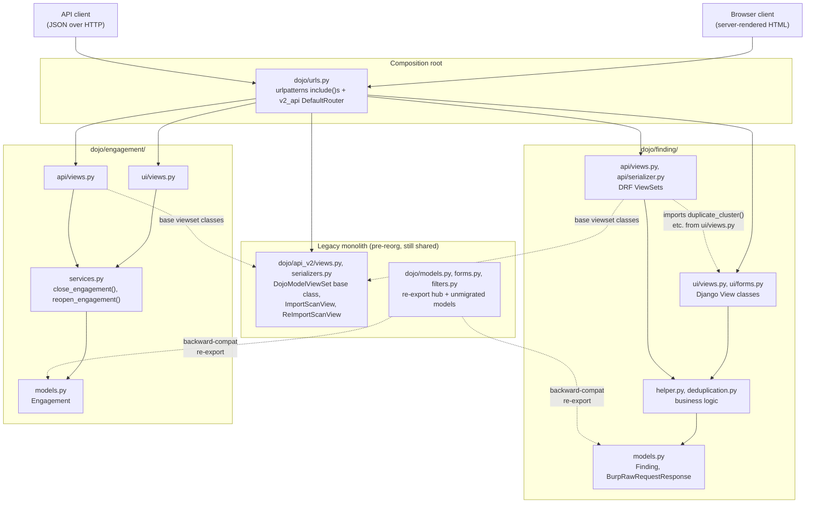
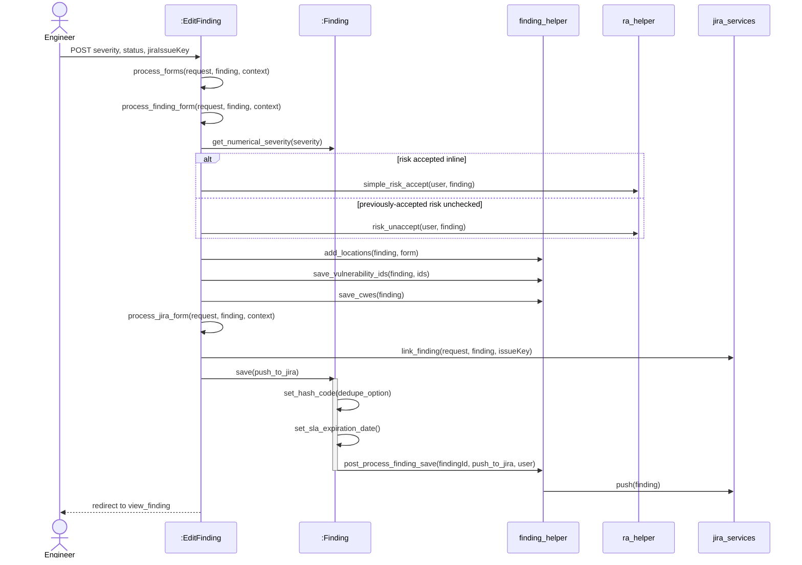
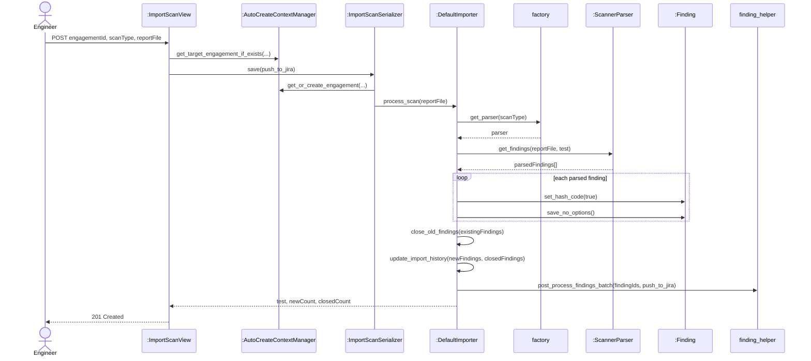

# Logical Architecture and Interaction Diagrams

CSCI 360: Software Architecture, Security, and Testing | Fall 2026 - Tyler McGuire

Prepared with Claude Code (Anthropic), run directly inside the local clone of this fork on
branch `master`. Every directory, import, class, method, and line number cited below was
checked directly against this repository - `dojo/finding/models.py`, `dojo/finding/ui/views.py`,
`dojo/finding/api/views.py`, `dojo/finding/helper.py`, `dojo/engagement/services.py`,
`dojo/engagement/ui/views.py`, `dojo/engagement/api/views.py`, `dojo/api_v2/views.py`,
`dojo/api_v2/serializers.py`, `dojo/importers/default_importer.py`,
`dojo/importers/base_importer.py`, `dojo/importers/auto_create_context.py`,
`dojo/risk_acceptance/helper.py`, `dojo/jira/services.py`, `dojo/tools/factory.py`,
`dojo/urls.py`, `dojo/settings/settings.dist.py`, and this fork's own `AGENTS.md` - not recalled
from general knowledge of DefectDojo or of Django conventions in the abstract. Full disclosure
is in the AI Use Log at the bottom.

This builds on [`requirements-and-use-cases.md`](requirements-and-use-cases.md) (the three
fully-dressed use cases) and [`ssds-and-operation-contracts.md`](ssds-and-operation-contracts.md)
(the three SSDs and operation contracts, each of which treated the system as one black box).
This assignment opens that box. It also draws directly on `AGENTS.md` in the repository root,
which is not course material - it is this fork's own live engineering plan for an in-progress
reorganization of `dojo/models.py`, `dojo/forms.py`, `dojo/filters.py`, `dojo/api_v2/serializers.py`,
and `dojo/api_v2/views.py` into per-domain modules. That document turns out to be the single best
source of evidence for this assignment: it names the exact architectural style the project is
migrating toward, documents real, currently-open separation-of-concerns problems with file:line
specificity, and states the project's own stated rule for where business logic belongs - which
makes it possible to point at a real violation of that rule instead of inventing one.

## Part 1: Architectural Style

DefectDojo is Django MVT with a REST client-server layer running alongside it, and - inside the
roughly forty domain modules `AGENTS.md` records as already reorganized - a layered structure on
top of that, but it is not one clean style end to end. `dojo/urls.py` is the composition root: it
wires Django's server-rendered `include()`d URLconfs for browser requests and, separately,
registers DRF viewsets onto a `DefaultRouter` (`v2_api = add_finding_urls(v2_api)`,
`dojo/urls.py:130`) for JSON API clients, confirmed as a real second interface by
`INSTALLED_APPS` carrying `"rest_framework"` and `"rest_framework.authtoken"`
(`dojo/settings/settings.dist.py`) - a genuine client-server split layered on top of ordinary MVT
(`dojo/templates/` renders the "T"). Inside a reorganized module such as `dojo/finding/` or
`dojo/engagement/`, the directory names read straight off a layered pattern - `models.py` (data),
`helper.py` or `services.py` (business logic), and two presentation packages, `ui/views.py`
(Django `View` classes) and `api/views.py` (DRF `ViewSet`s) - and dependency direction confirms
it: `dojo/finding/ui/views.py:31` and `dojo/finding/api/views.py:27` both
`import dojo.finding.helper as finding_helper`, never the reverse, and
`dojo/engagement/services.py`'s `close_engagement()` is called identically from
`dojo/engagement/ui/views.py:1110` and `dojo/engagement/api/views.py:108` - both presentation
layers depend on one shared business layer instead of on each other. But the layering is not
clean project-wide: `dojo/finding/api/views.py:37` still imports its base viewset classes from
the legacy `dojo/api_v2/views.py`, and `dojo/finding/api/views.py:59` imports
`duplicate_cluster`, `reset_finding_duplicate_status_internal`, and
`set_finding_as_original_internal` straight out of `dojo/finding/ui/views.py` - an API module
depending on a UI module, the wrong direction for MVT (this is the architectural concern in Part
4) - while `dojo/models.py`, `dojo/forms.py`, `dojo/filters.py`, `dojo/api_v2/serializers.py`,
and `dojo/api_v2/views.py` still hold code for modules `AGENTS.md`'s own "Monolithic Files Being
Decomposed" section says have not been split out of the original monolith at all. So: Django MVT
plus a parallel REST layer, genuinely layered inside the finished modules, but a hybrid mid
migration rather than one clean textbook style - which is exactly what `AGENTS.md`'s own
reorganization plan exists to finish.

## Part 2: Logical Architecture Diagram

Diagram source: [`logical-architecture-diagram.mmd`](logical-architecture-diagram.mmd). Drawn
from two representative reorganized modules (`dojo/finding/`, `dojo/engagement/`) rather than all
forty-odd, to keep the packages and arrows legible - the pattern shown repeats module to module.
Solid arrows are ordinary dependencies; dashed arrows are the two kinds of dependency that cross
where the reorganization is incomplete: `api/views.py` reaching sideways into `ui/views.py` or
down into the legacy `api_v2` base classes, and the legacy `dojo/models.py`/`forms.py`/`filters.py`
hub re-exporting names from the new module (`from dojo.finding.models import Finding  # noqa:
F401 -- backward compat`, `dojo/models.py:408`) so old call sites keep working - the monolith now
depends on the module, not the other way around, which is the reverse of what an un-migrated
reader would expect.



## Part 3: Two Interaction Diagrams

Both diagrams expand an SSD event from `ssds-and-operation-contracts.md` - the assignment only
requires one, but both use cases traced cleanly to real, distinctly different code, and using
both is stronger evidence than inventing a second operation with no SSD behind it at all.
Diagram 1 expands `saveFinding()` from the **Triage a Finding** SSD; Diagram 2 expands
`importScanResults()` from the **Import Scan Results** SSD. Their shapes are deliberately
different: Diagram 1 is a single Django `View` mutating one `Finding` inline; Diagram 2 is a DRF
`ViewSet` driving a batch pipeline across a parser factory and a Celery task, over a
possibly-thousands-long list of `Finding` instances.

### Diagram 1: Triage a Finding (expands the `saveFinding()` SSD event)

Diagram source: [`interaction-triage-a-finding.mmd`](interaction-triage-a-finding.mmd). Entry
point `EditFinding.post` (`dojo/finding/ui/views.py:1072`), which the SSD showed only as
`Engineer->>S: saveFinding(findingId, severity, status)`.



Every message traces to a real hop: `process_forms` (`dojo/finding/ui/views.py:1027`) calls
`process_finding_form` (`:906`), which calls `Finding.get_numerical_severity`
(`dojo/finding/models.py`, invoked at `:914`), branches on
`enable_simple_risk_acceptance` into `ra_helper.simple_risk_accept`/`risk_unaccept`
(`dojo/risk_acceptance/helper.py:427,453`, called at `:925,927`), and calls
`finding_helper.add_locations`/`save_vulnerability_ids`/`save_cwes`
(`dojo/finding/helper.py:1319,1363,1380`, called at `:929,946,947`); `process_forms` then calls
`process_jira_form` (`:962`), which calls `jira_services.link_finding`
(`dojo/jira/services.py:122`, called at `:990`); finally `process_forms` calls
`new_finding.save(push_to_jira=push_to_jira)` (`:1051`) - the `Finding.save()` override
(`dojo/finding/models.py:568-679`), which calls `set_hash_code` (`:625`),
`set_sla_expiration_date` (`:662`), and dispatches `finding_helper.post_process_finding_save`
(`:676-677`), which in turn calls `jira_services.push` (`dojo/finding/helper.py:461-463`). This
`Finding.save()` call is also the exhibit for the GRASP violation in Part 5.

### Diagram 2: Import Scan Results (expands the `importScanResults()` SSD event)

Diagram source: [`interaction-import-scan-results.mmd`](interaction-import-scan-results.mmd).
Entry point `ImportScanView.perform_create` (`dojo/api_v2/views.py:377`) - a DRF viewset, not a
Django `View`, and still in the legacy `api_v2` package rather than a `dojo/importers/` module of
its own, which `dojo/urls.py:112` confirms by registering it directly
(`v2_api.register(r"import-scan", ImportScanView, ...)`) rather than through an `add_x_urls()`
helper function the way `dojo/finding/` and `dojo/engagement/` are registered.



Every message traces to a real hop: `ImportScanView.perform_create` (`dojo/api_v2/views.py:377`)
calls `AutoCreateContextManager.get_target_engagement_if_exists` (`dojo/importers/
auto_create_context.py`, called at `:386`) and `serializer.save(push_to_jira=push_to_jira)`
(`:406`); `ImportScanSerializer.save` (`dojo/api_v2/serializers.py:753`) calls
`AutoCreateContextManager.get_or_create_engagement` (`:281`, called via `set_context` at
`:722,745`) and `CommonImportScanSerializer.process_scan` (`:551`, called at `:761`), which
resolves `DefaultImporter` from `dojo/importers/default_importer.py` and calls
`importer.process_scan` (called at `:565-568`); `DefaultImporter.process_scan`
(`dojo/importers/default_importer.py:93`) calls `self.get_parser()` (`:114`), which calls the
factory function `get_parser(scan_type)` (`dojo/tools/factory.py:32`), then
`self.parse_findings(scan, parser)` (`:119`), which reaches a concrete parser's `get_findings()`
(for example `dojo/tools/trivy/parser.py:159`); the per-finding loop inside
`_process_findings_internal` (`dojo/importers/default_importer.py:186-329`) calls
`finding.set_hash_code(True)` and `unsaved_finding.save_no_options()` (`:256,259`) for each
parsed finding; `process_scan` then calls `close_old_findings` (`:123`) and
`update_import_history` (`:140`, creating the `Test_Import` row the domain model calls
**Import**), and the batch loop dispatches `finding_helper.post_process_findings_batch` as a
Celery task (`:316-327`) rather than calling `post_process_finding_save` inline the way Diagram
1's single-`Finding` `save()` does - the same dedup/JIRA pipeline traced in Diagram 1, reached by
a different route because this operation processes many Findings at once instead of one.

## Part 4: One Architectural Concern

**`dojo/finding/api/views.py:59`** imports `duplicate_cluster`, `reset_finding_duplicate_status_internal`,
and `set_finding_as_original_internal` directly from `dojo/finding/ui/views.py`:

```python
from dojo.finding.ui.views import (
    duplicate_cluster,
    reset_finding_duplicate_status_internal,
    set_finding_as_original_internal,
)
```

Per the module's own split, `api/` and `ui/` are supposed to be sibling presentation layers that
both depend downward on `helper.py`/`models.py` - `dojo/finding/api/views.py:27` does exactly
that for the rest of its business logic (`import dojo.finding.helper as finding_helper`). These
three functions are the exception: they were written for the Django `View` first and never moved
down into `helper.py` where both layers could reach them without crossing tiers, so the REST API
viewset reaches sideways into the template-rendering layer instead. This costs two things: a
change made purely for the browser UI - say, altering `duplicate_cluster`'s signature to support
a new template field - can silently break the REST API, since nothing marks that function as a
cross-layer dependency; and the three functions cannot be unit-tested, or reused by some future
third presentation layer (a CLI, a GraphQL resolver), without dragging in the entire
`ui/views.py` module and the Django-request assumptions (`HttpRequest`, `render()`, form classes)
that come with it.

## Part 5: GRASP in Your Project

### Applied well #1: Information Expert - `Finding.status()`

`dojo/finding/models.py:1037-1060`:

```python
def status(self):
    status = []
    if self.under_review:
        status += ["Under Review"]
    if self.active:
        status += ["Active"]
    else:
        status += ["Inactive"]
    if self.verified:
        status += ["Verified"]
    if self.mitigated or self.is_mitigated:
        status += ["Mitigated"]
    ...
    return ", ".join([str(s) for s in status])
```

The human-readable status string is computed entirely from `Finding`'s own boolean fields
(`under_review`, `active`, `verified`, `mitigated`, `is_mitigated`, `false_p`, `out_of_scope`,
`duplicate`, `risk_accepted`) - no other class is consulted. `Finding` is the only object that
holds all nine facts this computation needs, so Information Expert puts the responsibility there
instead of, say, a view assembling the same string from nine separate field reads. It is exactly
the method the "Triage a Finding" code path itself calls (`old_status = finding.status()`,
`dojo/finding/ui/views.py:1030`) rather than re-deriving the status inline.

### Applied well #2: Low Coupling - `dojo/engagement/services.py`'s `close_engagement()`

`dojo/engagement/services.py:19-27`:

```python
def close_engagement(eng):
    eng.active = False
    eng.status = "Completed"
    eng.save()

    if jira_services.get_project(eng):
        task = jira_services.get_epic_task("close_epic")
        if task:
            dojo_dispatch_task(task, eng.id, push_to_jira=True)
```

The function takes one domain object (`Engagement`) and nothing else - no `HttpRequest`, no
form, no serializer - so it has no reason to change when either presentation layer changes, and
either layer can call it without depending on the other's types. That low coupling is exactly
what lets it be reused instead of duplicated: `dojo/engagement/ui/views.py:1110` and
`dojo/engagement/api/views.py:108` both call `close_engagement(eng)` verbatim, so the
"deactivate, mark Completed, close the JIRA epic" rule exists in exactly one place regardless of
which presentation layer triggered it.

### Violated: High Cohesion - `Finding.save()`

`dojo/finding/models.py:568-679` (the same method Diagram 1 calls into) is a single method
carrying five unrelated responsibilities: string normalization (`self.title =
titlecase(self.title[:511])`, `:582`), CVSS-vector parsing (`parse_cvss_data`, `:600-623`),
dedup hash computation (`self.set_hash_code(dedupe_option)`, `:625`), SLA-date computation
(`self.set_sla_expiration_date()`, `:662`), and deciding whether to kick off async
dedup/grading/JIRA post-processing (`finding_helper.post_process_finding_save(...)`,
`:676-677`). None of those five things is "persist this row" - the actual reason a `save()`
override exists - and none of them needs the other four to do its job. The method also needs
three separate lazy imports specifically to avoid circular dependencies it would otherwise
create:

```python
# dojo/finding/models.py:571
from dojo.finding import helper as finding_helper  # noqa: PLC0415 -- lazy import, avoids circular dependency
...
# dojo/finding/models.py:579
from dojo.utils import get_current_user  # noqa: PLC0415 -- lazy import, avoids circular dependency
...
# dojo/finding/models.py:673
from dojo.models import System_Settings  # noqa: PLC0415 -- lazy import, avoids circular dependency
```

A class with high cohesion has one reason to change; `Finding.save()` has at least five - a title
formatting rule change, a CVSS parsing bug fix, a dedup algorithm change, an SLA policy change,
and a post-processing trigger change would all mean editing the same 111-line method, and each of
the three lazy imports is a standing signal that `Finding` cannot actually be imported or tested
in isolation from `dojo.finding.helper`, `dojo.utils`, and `dojo.models` despite the module
boundaries nominally separating them.

## Part 6: Present in Class

Out of scope for this write-up - the ninety-second in-class presentation happens live and isn't
something to draft in advance. For that presentation: put
[the logical architecture diagram](#part-2-logical-architecture-diagram) on screen and name the
style from Part 1 in one sentence; show
[Diagram 1 (Triage a Finding)](#diagram-1-triage-a-finding-expands-the-savefinding-ssd-event) and
name the operation it traces; give the Part 4 finding (`dojo/finding/api/views.py:59`'s API-to-UI
import) as the one architectural cost to call out.

## AI Use Log

**Tool:** Claude Code (Anthropic), run directly inside this cloned fork at
`/Users/tyler/Projects/django-DefectDojo`, with shell, file-edit, and read access to the whole
repository.

**What I asked it to do, and what it did:**

1. Read `ssds-and-operation-contracts.md`, `requirements-and-use-cases.md`, and `domain-model.md`
   first, so the two interaction diagrams expanded the actual documented SSD events and cited
   the same real classes those pages already established, rather than starting from a fresh
   guess. Also read this fork's own `AGENTS.md`, since it turned out to be the single most
   relevant source in the repository for Parts 1, 2, and 4 - it is a live, in-progress plan to
   reorganize this exact codebase into layered domain modules, written by a prior session working
   on the actual reorganization, not course material.
2. Ran a research pass (partly via a background research agent, partly by direct file reads I
   verified myself afterward) across the real directory structure and import graph: listed
   `dojo/`'s top-level packages, the internal structure of `dojo/finding/` and
   `dojo/engagement/` (the two modules `AGENTS.md` marks "Complete"), and grepped for the exact
   import lines that show dependency direction between `ui/views.py`, `api/views.py`,
   `helper.py`/`services.py`, and `models.py` in both modules.
3. Independently re-verified every citation the research agent reported before using it, rather
   than trusting the report on its word: read `dojo/finding/models.py:1173-1176`
   (`has_jira_issue`'s lazy import), `dojo/engagement/api/views.py:101-109`
   (`EngagementViewSet.close`), `dojo/finding/api/views.py:55-62` (the API-to-UI import cited in
   Part 4), `dojo/api_v2/views.py:344` (`ImportScanView`), and `dojo/tools/factory.py:32-42`
   (`get_parser`) directly, and caught one small line-number discrepancy in the agent's report
   (`ImportScanSerializer.set_context` at `:722`, not `:719`) by reading the file myself.
4. Traced the "Triage a Finding" call chain hop by hop by reading
   `dojo/finding/ui/views.py:722-1085` (`EditFinding`) directly - `post` -> `process_forms` ->
   `process_finding_form`/`process_jira_form` -> `Finding.save()` -> `finding_helper.
   post_process_finding_save` - confirming every method name and line number before writing
   Diagram 1, and noting that this chain is the actual implementation behind the `saveFinding()`
   operation contract's postconditions in `ssds-and-operation-contracts.md` (the "severity/status
   set, `reviewedDate` set to today, associated with Engineer" postconditions map directly to
   `dojo/finding/ui/views.py:915-916`).
5. Traced the "Import Scan Results" call chain the same way through
   `dojo/api_v2/views.py:377-409` (`ImportScanView.perform_create`),
   `dojo/api_v2/serializers.py:551-761` (`ImportScanSerializer.save`,
   `CommonImportScanSerializer.process_scan`), and `dojo/importers/default_importer.py:93-329`
   (`DefaultImporter.process_scan`, `_process_findings_internal`), deliberately choosing this
   over a second UI-driven flow so the two diagrams would have genuinely different shapes (single
   Django `View` mutating one object vs. a DRF viewset driving a batch pipeline through a parser
   factory and a Celery task).
6. Chose the Part 4 architectural concern by looking for the assignment's own named categories
   (layer bypass, circular dependency, misplaced responsibility) rather than reusing the same
   `Finding.save()` evidence twice - found `dojo/finding/api/views.py:59` importing three
   functions from `dojo/finding/ui/views.py` (an API module depending on a UI module, the wrong
   direction for the module's own `ui`/`api` split), and confirmed this is a different piece of
   evidence from the Part 5 violation before writing both sections, so the two parts of the
   assignment aren't secretly citing the identical bug.
7. Chose the Part 5 GRASP violation deliberately to reuse the `Finding.save()` call already shown
   in Diagram 1, per the assignment's own hint that a questionable responsibility assignment
   already visible in an interaction diagram is the easiest place to look, rather than
   introducing new evidence unconnected to the diagrams.
8. Attempted to render all three Mermaid diagrams through the public `mermaid.ink` rendering
   service the same way prior assignments in this repository did, to visually confirm they
   render without syntax errors before publishing. That request was blocked by this session's own
   data-sharing safeguard (uploading content to a public third-party service), so instead I
   checked each diagram by hand against Mermaid's documented `flowchart`/`sequenceDiagram`
   grammar (subgraph nesting and direction, `alt`/`else`/`end` and `loop`/`end` block closure,
   `activate`/`deactivate` pairing) rather than a rendered image. This is a lower bar than the
   prior assignments cleared and is disclosed here rather than left unstated.
9. Wrote the sections above; I reviewed and adjusted them before publishing.

**Net effect:** every directory, import statement, method name, line number, and code quote
above was checked directly in this repository - including two places (`AGENTS.md`'s own
documented reorganization state, and the research agent's report) I treated as leads to verify
myself rather than facts to restate, and one actual discrepancy (`:719` vs `:722`) that
independent verification caught. The one gap from house style, noted above, is that the three
diagrams were checked by hand rather than by rendering and reading an image, since the rendering
step itself was blocked this session.
