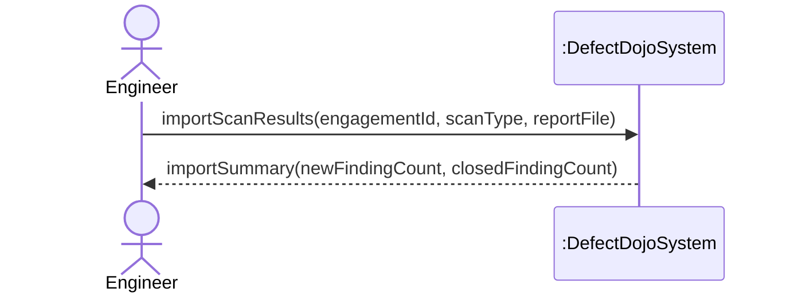
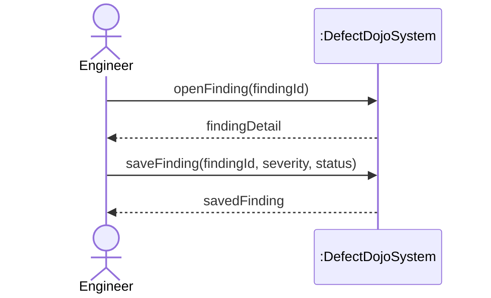
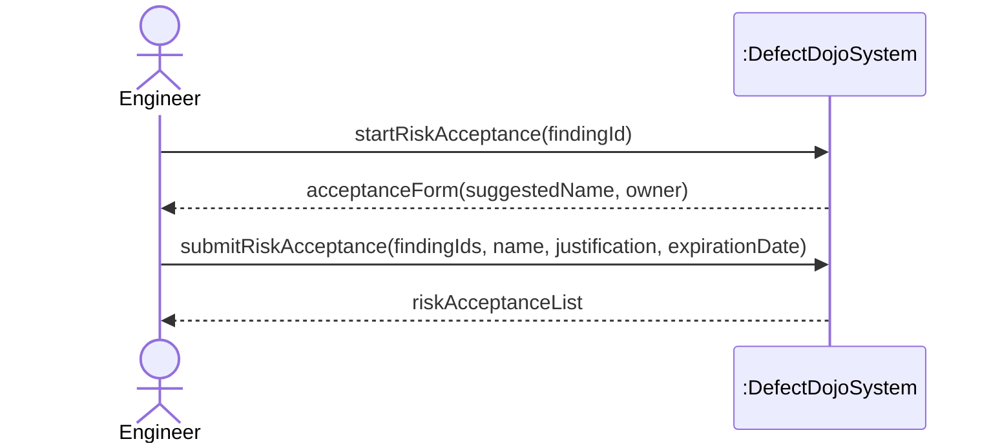

# SSDs and Operation Contracts

CSCI 360: Software Architecture, Security, and Testing | Fall 2026 - Tyler McGuire

Prepared with Claude Code (Anthropic), run directly inside the local clone of this fork on
branch `master`. Every class, field, and line number cited below was checked directly against
this repository - `dojo/test/models.py`, `dojo/tool_config/models.py`,
`dojo/notifications/models.py`, `dojo/jira/models.py`, `dojo/risk_acceptance/models.py`,
`dojo/finding/models.py`, `dojo/product/models.py`, `dojo/engagement/models.py` - not recalled
from general knowledge of DefectDojo. Full disclosure is in the AI Use Log at the bottom.

This builds directly on
[`requirements-and-use-cases.md`](requirements-and-use-cases.md) (the three fully-dressed use
cases: Import Scan Results, Triage a Finding, Accept Risk for a Finding) and
[`domain-model.md`](domain-model.md) (the domain model those use cases just revised).

## Part 1: Tighten the Domain Model

Noun phrases below are cited to the use case step (or precondition/extension) they came from.
"Conceptual class" and "Attribute" entries that are new are marked **(new)**; everything else
already existed in the seven-class model. The revised domain model with all eleven classes is
in [`domain-model.md`](domain-model.md); the reasoning for each addition is there too.

### Import Scan Results

| Noun phrase | Found in | Decision | Why |
|---|---|---|---|
| Engineer | step 1 | Conceptual class **(new)** | The actor performing every step; no class in the old model represented a person at all. |
| Engagement | step 1 | Conceptual class | Already in the domain model. |
| scan type | step 1 | Attribute of Test | `Test.testType` already models this; not a new class. |
| report file | step 1 | Neither | A UI upload input. DefectDojo doesn't need the raw file itself to be a durable domain concept - only what gets parsed out of it. |
| tool configuration | precondition | Conceptual class **(new)** | Checked against `Tool_Configuration` (`dojo/tool_config/models.py:5`): it persists independently of any one import and is reused import after import - Larman's test for a class, not an attribute. |
| parser | step 3 | Neither | An internal software mechanism (`dojo/tools/factory.py`) for choosing how to read a file, not a real-world domain concept. |
| hash code | step 4 | Attribute of Finding **(new: `Finding.hashCode`)** | A computed value, checked against `Finding.hash_code` (`dojo/finding/models.py:340`) - text, per Larman's rule, not a class. |
| the scanner's dedupe field set | step 4 | Neither | `HASHCODE_FIELDS_PER_SCANNER` is a global per-scanner system setting, not an instance tied to any one import. |
| Finding | step 4 | Conceptual class | Already in the domain model. |
| import-history entry | step 6 | Conceptual class **(new: Import)** | A created record with its own identity and counts, checked against `Test_Import` (`dojo/test/models.py:234`). |
| notification | step 7 | Conceptual class **(new: Notification)** | Sent to a specific person and reviewed later - checked against `Alerts` (`dojo/notifications/models.py:123`), not the similarly-named `Notifications` model, which is actually per-user notification preferences. |
| Finding list | step 8 | Neither | A UI display. |
| JIRA (extension 4b) | - | Neither (external actor) | Already modeled as a supporting actor in the use-case diagram, not a class inside the system boundary. |

### Triage a Finding

| Noun phrase | Found in | Decision | Why |
|---|---|---|---|
| Finding | step 1 | Conceptual class | Already in the domain model. |
| edit view | step 1 | Neither | UI. |
| JIRA project | step 2 | Attribute of Product **(new: `Product.jiraProjectKey`)** | Checked against `JIRA_Project.project_key` (`dojo/jira/models.py:105`) - a stored identifier, not something with its own behavior in this domain model. |
| JIRA sub-form | step 2 | Neither | UI element. |
| severity | step 3 | Attribute of Finding | Already modeled. |
| status | step 3 | Attribute of Finding | Already modeled. |
| Engineer (`last_reviewed_by`) | step 4 | Association, not attribute | A person, not text - checked against `Finding.last_reviewed_by`, a foreign key to `Dojo_User` (`dojo/finding/models.py:318`), so it becomes `Engineer -- Finding : reviewedBy`, reusing the same Engineer class. |
| `last_reviewed` (date) | step 4 | Attribute of Finding **(new: `Finding.reviewedDate`)** | Checked against `Finding.last_reviewed` (`dojo/finding/models.py:314`). |
| false-positive history | step 5 | Neither | Internal bookkeeping the system uses for future deduplication; the domain-relevant fact is already covered by `Finding.status`. |
| JIRA issue key | extension 3a | Attribute of Finding **(new: `Finding.jiraIssueKey`)** | Checked against `JIRA_Issue.jira_key` (`dojo/jira/models.py:186`) - a stored identifier, same reasoning as the JIRA project key above. |
| success message | step 6 | Neither | UI feedback. |

### Accept Risk for a Finding

| Noun phrase | Found in | Decision | Why |
|---|---|---|---|
| Finding(s) | steps 1-2 | Conceptual class | Already in the domain model. |
| acceptance name | step 1 | Attribute of RiskAcceptance | Already modeled. |
| owner | step 1 | Association, not attribute | Checked against `Risk_Acceptance.owner`, a required foreign key to `Dojo_User` (`dojo/risk_acceptance/models.py:53`) - `Engineer -- RiskAcceptance : ownedBy`, reusing the Engineer class again rather than adding a fourth. |
| form | step 1 | Neither | UI. |
| justification | step 2 | Attribute of RiskAcceptance | Already modeled. |
| expiration date | step 2 | Attribute of RiskAcceptance | Already modeled. |
| Engagement | step 4 | Conceptual class, and a missing association | Already in the domain model, but "attaches it to the Engagement" revealed the old model never linked RiskAcceptance to Engagement at all - checked against `Engagement.risk_acceptance` (`dojo/engagement/models.py:73`). Added as `Engagement -- RiskAcceptance : has`. |
| Note | step 5 | Conceptual class, and a missing association | Already in the domain model, but the justification is saved as a Note on the *acceptance*, not the Finding - checked against `Risk_Acceptance.notes` (`dojo/risk_acceptance/models.py:61`). Added as `RiskAcceptance -- Note : annotatedBy`. |
| full risk acceptance enabled | extension 1a | Attribute of Product **(new: `Product.fullRiskAcceptanceEnabled`)** | Checked against `Product.enable_full_risk_acceptance` (`dojo/product/models.py:118`) - a per-product setting real enough to gate what the Engineer is allowed to do, but still a boolean value, not a class. |
| risk-acceptance list | step 6 | Neither | UI display. |

## Part 2: System Sequence Diagrams

Each SSD shows only the Engineer (the primary actor in all three use cases) and the system as
one black box. Solid arrows are calls from the Engineer; dashed arrows are the system's return
values. Diagram source is inline below and also kept as standalone `.mmd` files for reference:
[`ssd-import-scan-results.mmd`](ssd-import-scan-results.mmd),
[`ssd-triage-a-finding.mmd`](ssd-triage-a-finding.mmd),
[`ssd-accept-risk-for-a-finding.mmd`](ssd-accept-risk-for-a-finding.mmd).

### SSD: Import Scan Results

The main success scenario's steps 2-7 (verifying the tool configuration, selecting a parser,
hashing and creating Findings, closing stale ones, updating timestamps, queuing a notification)
are all internal to the system - none of them is an event the Engineer sends or a value the
Engineer supplies mid-scenario, so they collapse into the single request/response pair an SSD
is allowed to show.

### SSD: Triage a Finding

### SSD: Accept Risk for a Finding

## Part 3: Operation Contracts

One contract per SSD, chosen for the event that actually changes the domain rather than a pure
lookup (`openFinding()` and `startRiskAcceptance()` are excluded for exactly that reason).

### Operation: importScanResults(engagementId: EngagementID, scanType: String, reportFile: File)

**Cross-references:** Use case Import Scan Results

**Preconditions:**
- An Engineer is authenticated and a member of the Product owning the Engagement identified by
  `engagementId`
- A ToolConfiguration exists for that Product if `scanType` requires pulling from an API rather
  than a file upload

**Postconditions:**
- A Test instance was created
- The Test was associated with the Engagement
- For each new vulnerability in the report, a Finding instance was created
- Each new Finding's `hashCode` was set to the value computed from the scanner's dedupe fields
- Each new Finding's `discoveredDate` was set to today
- Each new Finding was associated with the Test
- Each previously-imported Finding for the Engagement that no longer appeared in the report had
  its `status` set to Closed
- An Import instance was created
- The Import's `newFindingCount` was set to the number of Findings created
- The Import's `closedFindingCount` was set to the number of Findings closed
- The Import was associated with the Test
- A Notification instance was created
- The Notification was associated with the Engineer

### Operation: saveFinding(findingId: FindingID, severity: String, status: String)

**Cross-references:** Use case Triage a Finding

**Preconditions:**
- A Finding identified by `findingId` exists
- An Engineer with edit permission on the Finding's Product is authenticated

**Postconditions:**
- The Finding's `severity` was set to `severity`
- The Finding's `status` was set to `status`
- The Finding's `reviewedDate` was set to today
- The Finding was associated with the Engineer (`reviewedBy`)

### Operation: submitRiskAcceptance(findingIds: List\<FindingID\>, name: String, justification: String, expirationDate: Date)

**Cross-references:** Use case Accept Risk for a Finding

**Preconditions:**
- Each Finding identified in `findingIds` exists and is not already covered by an active
  RiskAcceptance
- The Engagement's Product has `fullRiskAcceptanceEnabled` set to true

**Postconditions:**
- A RiskAcceptance instance was created
- The RiskAcceptance's `name` was set to `name`
- The RiskAcceptance's `justification` was set to `justification`
- The RiskAcceptance's `expirationDate` was set to `expirationDate`
- The RiskAcceptance was associated with the Engagement
- The RiskAcceptance was associated with the Engineer (`ownedBy`)
- Each Finding in `findingIds` was associated with the RiskAcceptance
- A Note instance was created
- The Note's `text` was set to `justification`
- The Note was associated with the RiskAcceptance

## AI Use Log

**Tool:** Claude Code (Anthropic), run directly inside this cloned fork at
`/Users/tyler/Projects/django-DefectDojo`, with shell, file-edit, and read access to the whole
repository.

**What I asked it to do, and what it did:**

1. Read `requirements-and-use-cases.md` and `domain-model.md` first, so the noun-phrase pass
   worked from the actual fully-dressed use cases and the actual existing model rather than a
   fresh guess at either.
2. For every noun phrase where the classification wasn't obvious (tool configuration, import-
   history entry, notification, JIRA project, JIRA issue key, last_reviewed_by, owner, full risk
   acceptance enabled), grepped and read the real Django model before deciding: `Tool_Configuration`
   (`dojo/tool_config/models.py`), `Test_Import` (`dojo/test/models.py`), `Notifications` and
   `Alerts` (`dojo/notifications/models.py` - confirmed these are two different models and that
   `Alerts`, not `Notifications`, is the one that matches "a notification" in the use case text),
   `JIRA_Issue` and `JIRA_Project` (`dojo/jira/models.py`), `Risk_Acceptance`
   (`dojo/risk_acceptance/models.py` - confirmed `owner` is a required FK to `Dojo_User` and
   `notes` is a many-to-many to `Notes`), `Engagement.risk_acceptance`
   (`dojo/engagement/models.py:73` - confirmed it's a many-to-many, which is why the "What
   changed" note in the domain model calls out that the diagram simplifies it to one-to-many for
   the ordinary case), `Finding.last_reviewed`/`last_reviewed_by`/`hash_code`
   (`dojo/finding/models.py:314,318,340`), and `Product.enable_full_risk_acceptance`
   (`dojo/product/models.py:118`).
3. Deliberately checked whether `Test_Import` records who performed the import before adding an
   Engineer-Import association, found no such field, and left the association out rather than
   modeling an audit trail the real system doesn't keep - recorded as a "Deliberately excluded"
   entry in the domain model rather than silently dropped.
4. Wrote the three SSDs, then rendered all three through `mermaid.ink` (base64-encoded diagram
   source, fetched as an image) and read the resulting images directly to confirm each renders
   as a single system box with the Engineer as the only actor and no internal detail leaking
   in - not just that the Mermaid syntax parses.
5. Rendered the full eleven-class domain model diagram the same way after editing it, to catch
   any Mermaid syntax errors from the added classes and associations before committing, since a
   syntax error in a `classDiagram` block fails silently in some renderers rather than in others.
6. Chose the three contract operations by first eliminating the two pure-lookup events in the
   SSDs (`openFinding()`, `startRiskAcceptance()`), matching the assignment's explicit
   instruction not to write a contract for something with no interesting postconditions.
7. Wrote every postcondition in one of the three required precise forms (instance created,
   attribute set to a value, association formed) and checked each class and attribute named
   against the revised domain model above it, rather than inventing new terms mid-contract.
8. Wrote the sections above; I reviewed and adjusted them before publishing.

**Net effect:** every new class, attribute, and association in the revised domain model points
at a real Django model and field checked directly in this repository, including the one place
(Import-Engineer) where the real system turned out *not* to keep a fact the domain conceptually
has, which is called out rather than assumed.
